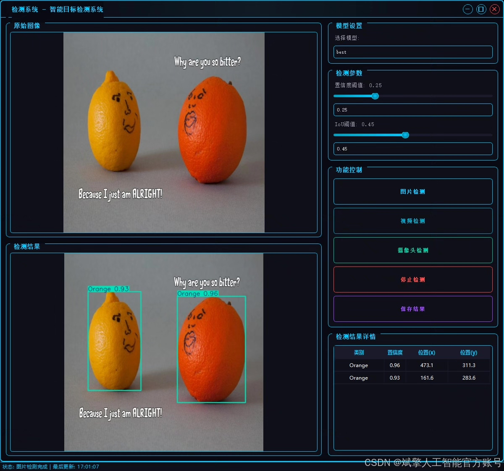
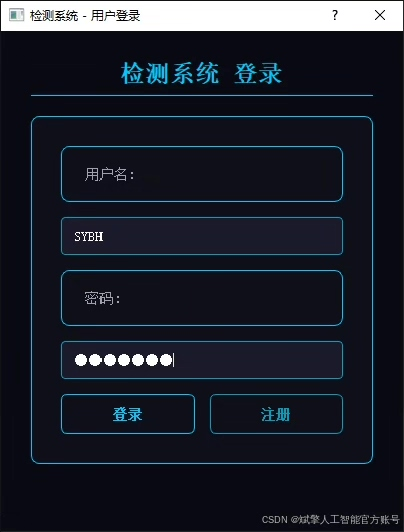
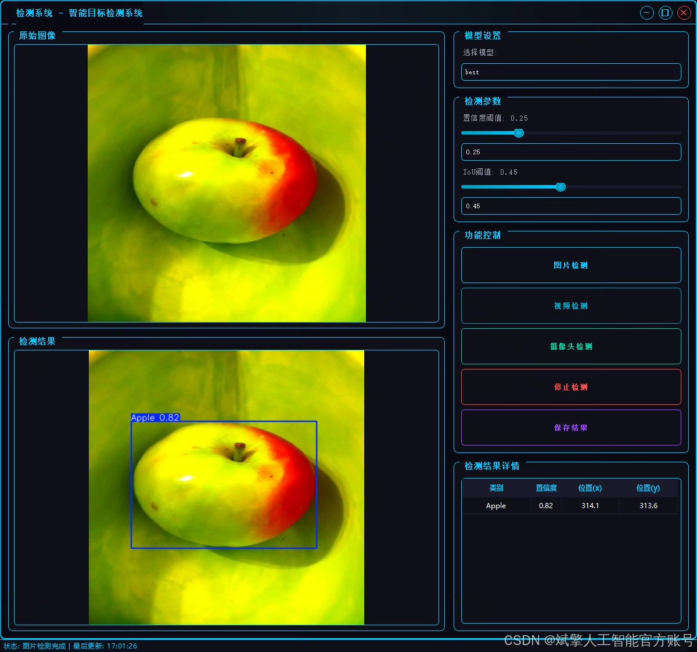
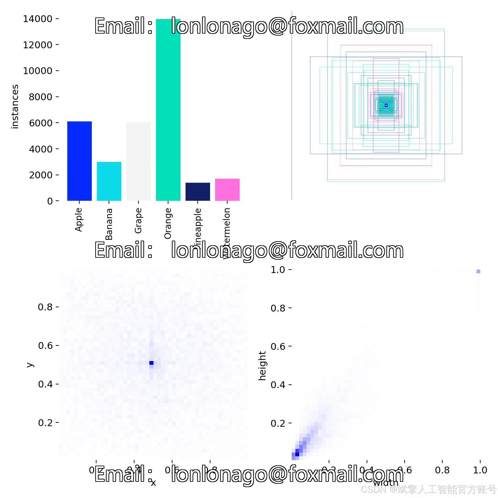
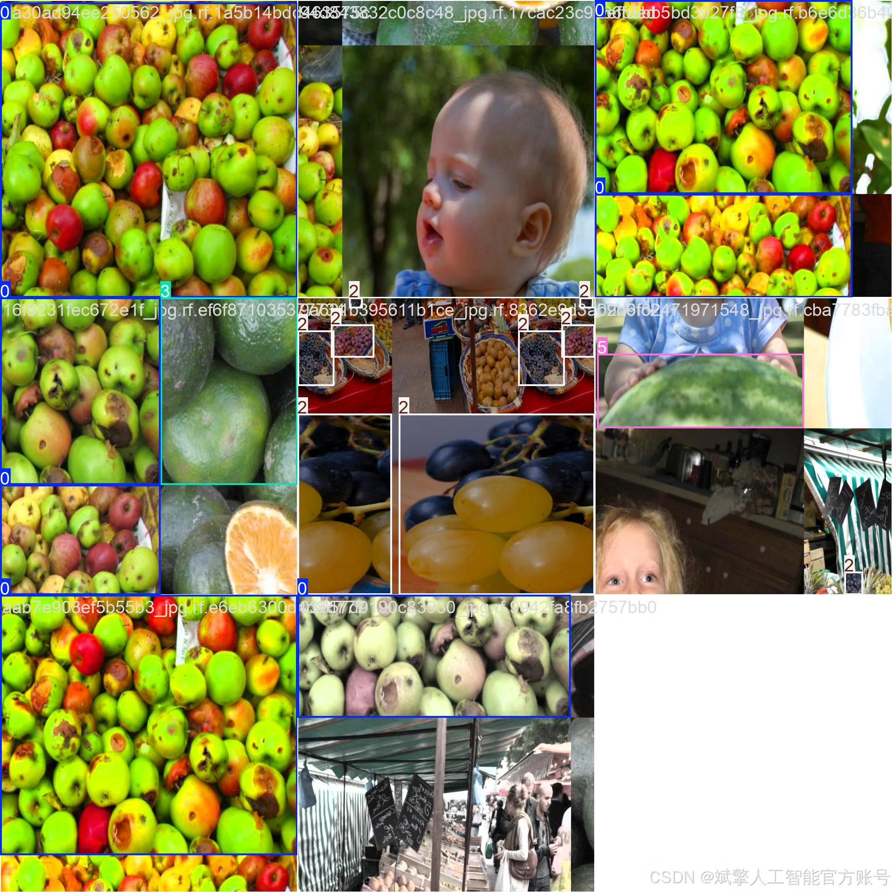
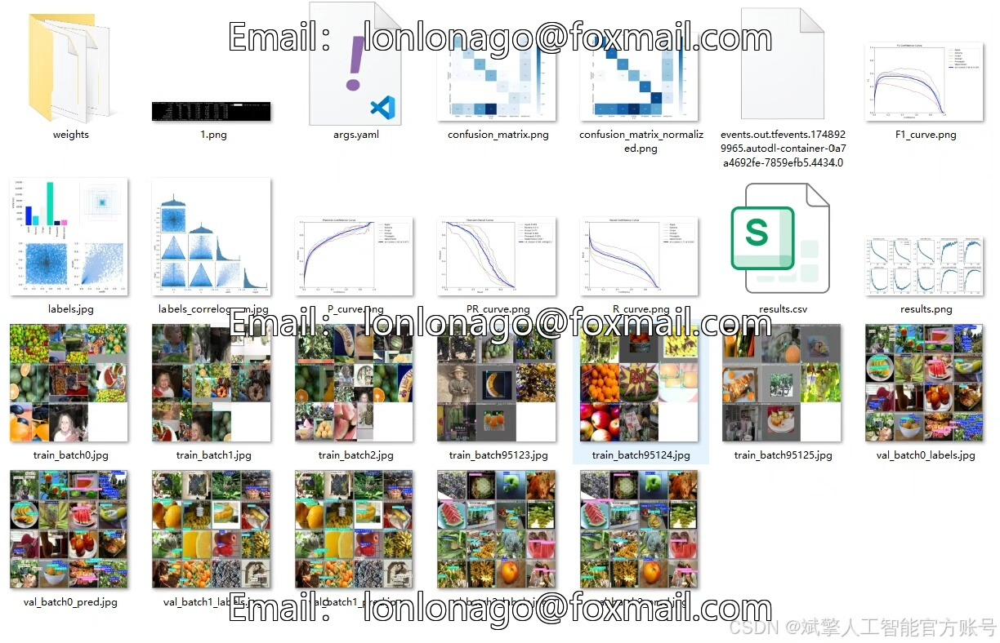
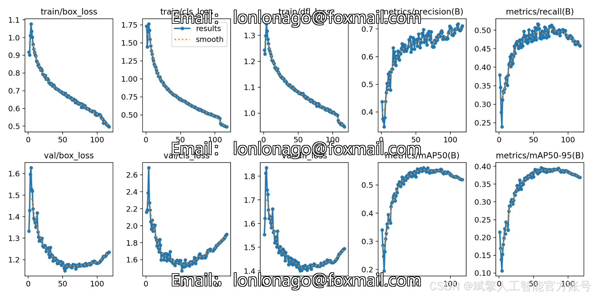
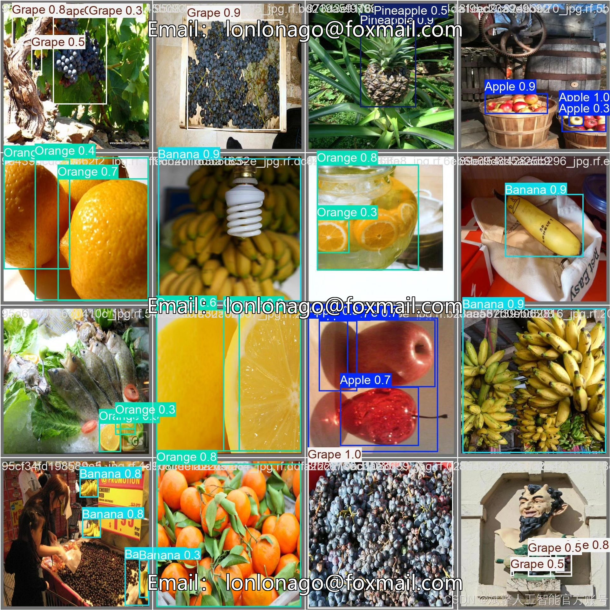

# YOLOv12 Fruit Recognition System

## Body

YOLOv12 Fruit Recognition System Based on Deep Learning YOLOv12: A Fruit Recognition and Detection System (YOLOv12+YOLO dataset + UI interface + login registration interface + Python project source code + model)

This paper designs and implements a fruit recognition and detection system based on deep learning YOLOv12, capable of accurately and efficiently recognizing six common fruits, including Apple, Banana, Grape, Orange, Pineapple, and Watermelon. The system utilizes the YOLOv12 object detection algorithm, combined with high-quality labeled YOLO format datasets, containing 7,108 training images, 914 validation images, and 457 test images, to ensure the reliability and generalization capability of the model training.

✅ User Login and Registration: Supports password verification and security validation.
✅ Three Detection Modes: Based on the YOLOv12 model, supports image, video, and real-time camera detection, with precise target recognition.
✅ Dual-Screen Comparison: Displays the original scene and detection results simultaneously on the same screen.
✅ Data Visualization: Real-time table displaying the category, confidence, and coordinates of detected targets.
✅ Intelligent Parameter Tuning: Offers a confidence slide bar for dynamically optimizing detection accuracy, adapting to different scene requirements.
✅ Sci-Fi Interactive Interface: Dark theme paired with dynamic light effects, reducing visual fatigue and enhancing operational experience.

## Images

## Payment

Here is a pay link on Stripe ( https://buy.stripe.com/3cs8yP7sY87d0vu9AB ). Please contact me lonlonago@foxmail.com after funding $89, and I will send you a complete data files , thank you!

